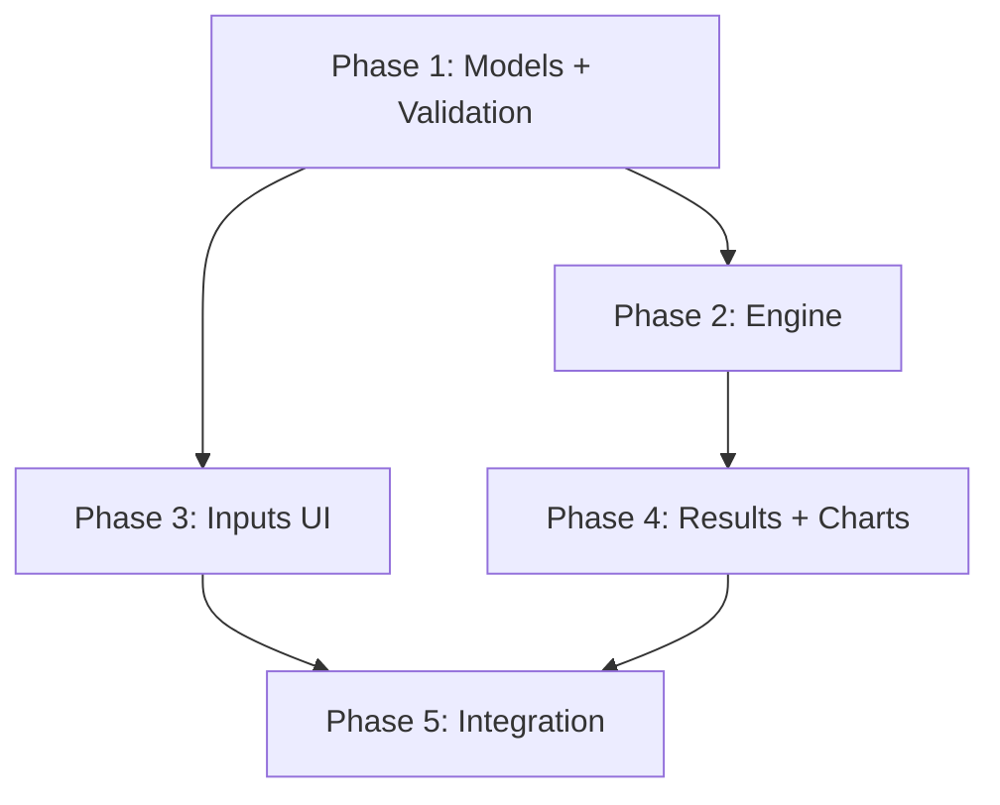

# Development Design Specification

Monte Carlo Retirement Planner — Implementation Guide

| Field | Value |
| --- | --- |
| Source of Truth | `docs/MonteCarloRetirementPlanner-FuncSpec.md` v1.0 |
| Scope | All app logic, UI, simulation, validation, charts, tests |
| Out of Scope | Deployment / packaging (see `docs/deployment-setup-spec.md`) |
| Target Stack | Python ≥ 3.11 · Streamlit ≥ 1.35 · NumPy ≥ 1.26 · Plotly ≥ 5.22 · Pandas ≥ 2.2 · SciPy ≥ 1.13 |

---

## 1) Executive Summary

The current codebase is a working scaffold that demonstrates the basic Monte Carlo pattern but implements only a small subset of the functional specification. This document provides a phased implementation plan to bring the code into full alignment with the approved spec, identifies every gap between current code and spec, and specifies the technical design for each module.

---

## 2) Architecture Decisions

### 2.1 Module Structure

The functional spec (Appendix D) suggests a flat file layout (`simulation.py`, `validators.py`, `charts.py`). The current repo uses a package layout (`simulation/`, `ui/`, `utils/`). **Decision: retain the package layout** — it is already established, supports better test isolation, and is compatible with the spec's dependency rules.

Reconciled structure:

```text
myfinmodel/
  app.py                      # Streamlit entry point (UI orchestration only)
  simulation/
    __init__.py
    models.py                 # Dataclasses, enums, type definitions
    engine.py                 # Vectorized Monte Carlo engine (replaces monte_carlo.py)
    guardrails.py             # Guardrail logic (GR1–GR4 + floor/ceiling)
  validation/
    __init__.py
    validators.py             # Input validation — zero Streamlit imports
  ui/
    __init__.py
    inputs.py                 # Inputs tab rendering
    outputs.py                # Results tab rendering
    scenarios.py              # Scenario save/load/compare UI
  utils/
    __init__.py
    charts.py                 # Plotly chart builders — zero Streamlit imports
  tests/
    __init__.py
    test_models.py
    test_engine.py            # Replaces test_monte_carlo.py
    test_guardrails.py
    test_validators.py
    test_charts.py
```

### 2.2 Key Design Rules (from Spec §1.4 / Appendix D)

1. `simulation/` and `validation/` must have **zero** Streamlit imports.
2. `utils/charts.py` must have **zero** Streamlit imports (returns `go.Figure` objects).
3. Only `app.py` and `ui/` import Streamlit.
4. The simulation engine must be deterministic for a given seed and inputs.
5. Per-year guardrail logic loops over years but vectorizes across all `n_paths` simultaneously.

### 2.3 Variable Naming Convention

The spec defines normative variable names. Where the current code diverges, rename to match the spec:

| Current Name | Spec Name | Notes |
| --- | --- | --- |
| `initial_portfolio` | `port_start` | Rename in models and all references |
| `annual_spending` | (removed — replaced by spending tiers) | Tiers provide per-age spending |
| `mean_return` | `ret_mean` | Rename |
| `return_std` | `ret_std` | Rename |
| `mean_inflation` | `inf_mean` | Rename |
| `inflation_std` | `inf_std` | Rename |
| `years` | `plan_years` | Rename |
| `num_simulations` | `n_paths` | Rename |
| `random_seed` | `random_seed` | No change |
| `guardrail_model` | (removed — replaced by GR1–GR4 toggles) | Spec uses 4 independent guardrails |

---

## 3) Gap Analysis: Current Code vs. Functional Spec

### 3.1 Data Model (`simulation/models.py`)

| Spec Requirement | Current State | Gap |
| --- | --- | --- |
| Portfolio breakdown (taxable, tax_deferred, roth) | Not present | ADD |
| Tax rates (ltcg_rate, ord_income_rate) | Not present | ADD |
| Unrealized gain % | Not present | ADD |
| Personal info (current_age, retire_age, ss_start_age, filing_status) | Not present | ADD |
| Spending tiers (1–5 age-range tiers) | Single `annual_spending` float | REPLACE |
| Spending floor / ceiling | Not present | ADD |
| Social Security (ss_enabled, ss_annual, ss_cola) | Not present | ADD |
| Health insurance (medicare_age, premium, ACA fields) | Not present | ADD |
| Portfolio style presets | Not present | ADD |
| Return–inflation correlation (`ret_inf_corr`) | Not present | ADD |
| Inflation floor (`inf_floor`) | Not present | ADD |
| GR1 params (floor_pct, ceil_pct, cut_pct, raise_pct) | Partially present (different model) | REWRITE |
| GR2 params (low_rate, warn_rate, crit_rate + cuts/raises) | Not present | ADD |
| GR3 params (ACA MAGI) | Not present | ADD |
| GR4 params (inflation trigger) | Not present | ADD |
| GuardrailModel enum (3 values) | Present but wrong model | REMOVE (replaced by independent toggles) |
| SimulationResult per-path arrays | Basic (portfolio_values, annual_spending) | EXPAND (add wr, events, ss_income, etc.) |
| Engine return structure (dict with 13+ arrays) | Object-based SimulationSummary | REWRITE to match spec §3.6 |

### 3.2 Simulation Engine (`simulation/monte_carlo.py`)

| Spec Requirement | Current State | Gap |
| --- | --- | --- |
| Bivariate normal draws with `ret_inf_corr` | Independent normal draws | REWRITE |
| Inflation floor clipping | Not implemented | ADD |
| Vectorized across paths (year loop, path vector) | Python loop over paths AND years | REWRITE to vectorize path dimension |
| 8-step per-year loop (age, SS, health, tiers, guardrails, tax gross-up, portfolio update, store) | Simplified 3-step loop | REWRITE |
| SS income calculation with COLA | Not present | ADD |
| Health insurance cost (Medicare + ACA) | Not present | ADD |
| Spending tier lookup by age | Not present (single flat value) | ADD |
| Tax gross-up via effective rate | Not present (withdrawal = spending) | ADD |
| 4 independent guardrails in sequence | Single guardrail model dispatch | REWRITE |
| Floor/ceiling clamp after guardrails | Not present | ADD |
| Event codes per year per path | Not present | ADD |
| Full result arrays (13+ matrices) | Minimal per-path lists | REWRITE |
| Performance: <5s for 1000 paths × 35 years | Met (simple model) | Verify after rewrite |

### 3.3 Input Validation (`validation/validators.py`)

| Spec Requirement | Current State | Gap |
| --- | --- | --- |
| Dedicated validation module | Does not exist | CREATE |
| port_start > 0 (block run) | Not validated | ADD |
| Account sum advisory warning | Not present | ADD |
| Spending tier contiguity/coverage (block run) | Not present | ADD |
| Floor < ceiling (block run) | Not present | ADD |
| GR2 rate ordering (block run) | Not present | ADD |
| Memory guard warning (n_paths × plan_years > 500k) | Not present | ADD |
| Inflation floor ≤ inf_mean warning | Not present | ADD |
| ACA ordering (block run) | Not present | ADD |
| Covariance matrix positive semi-definite (block run) | Not present | ADD |

### 3.4 Inputs UI (`ui/inputs.py`)

| Spec Requirement | Current State | Gap |
| --- | --- | --- |
| 7 collapsible input sections | 2-column flat form | REWRITE |
| Portfolio breakdown inputs (3 accounts + tax rates) | Single portfolio number | EXPAND |
| Personal info section (age, retire_age, filing_status) | Not present | ADD |
| Spending tiers (dynamic Add/Remove) | Single spending input | REPLACE |
| Social Security section | Not present | ADD |
| Health Insurance / ACA section | Not present | ADD |
| Portfolio style presets with auto-fill | Not present | ADD |
| Return–inflation correlation slider | Not present | ADD |
| Inflation floor slider | Not present | ADD |
| GR1–GR4 independent toggle sections | Single guardrail model dropdown | REPLACE |
| Input validation inline errors/warnings | Minimal | EXPAND |
| Scenario save/load/compare | Not present | ADD |
| "Run Simulation" button placement | Present in form | KEEP (adjust placement) |

### 3.5 Results UI (`ui/outputs.py`)

| Spec Requirement | Current State | Gap |
| --- | --- | --- |
| Run status/metadata row | Not present | ADD |
| 8 summary dashboard metric cards | 6 basic metrics | EXPAND |
| Tabbed sub-sections (7 tabs) | Flat sequential layout | RESTRUCTURE |
| Full success metrics table (4 categories, 25+ rows) | Basic percentile table | REWRITE |
| 6 Plotly charts (portfolio fan, spending fan, guardrail events bar, survival donut, WR over time, inflation paths) | 3 charts (fan, spending fan, histogram) | ADD 3, REPLACE histogram with donut |
| Nominal/real toggle on fan charts | Not present | ADD |
| Age-based X-axis (not year index) | Year-index X-axis | CHANGE |
| Vertical annotation lines (SS start, Medicare) | Not present | ADD |
| 5 downloadable CSV tables | Not present | ADD |
| Scenario comparison overlay view | Basic side-by-side | ENHANCE |
| Stale results banner | Not present | ADD |

### 3.6 Charts (`utils/charts.py`)

| Spec Requirement | Current State | Gap |
| --- | --- | --- |
| Portfolio fan chart with age X-axis, annotations | Year-index X-axis, no annotations | MODIFY |
| Spending fan chart with floor/ceiling lines | Basic spending fan | MODIFY |
| Guardrail event stacked bar chart | Not present | ADD |
| Survival rate donut chart | Success gauge (different viz) | REPLACE |
| Withdrawal rate over time (box plot / fan) | Not present | ADD |
| Inflation path distribution fan chart | Not present | ADD |

### 3.7 State Management & App Structure (`app.py`)

| Spec Requirement | Current State | Gap |
| --- | --- | --- |
| `st.session_state["inputs"]` dict | Scattered session state keys | CONSOLIDATE |
| `st.session_state["results"]` dict | `st.session_state["last_summary"]` object | RENAME/RESTRUCTURE |
| `st.session_state["scenarios"]` list (max 5) | Not present | ADD |
| `st.session_state["results_stale"]` flag | Not present | ADD |
| Comparison via saved scenarios (not separate form) | Separate Scenario B form | REWRITE |

---

## 4) Phased Implementation Plan

### Phase 1 — Foundation: Data Models + Validation

**Goal:** Establish the correct data structures and validation layer that all other modules depend on.

**Deliverables:**
1. Rewrite `simulation/models.py` with spec-aligned dataclasses and variable names
2. Create `validation/__init__.py` and `validation/validators.py`
3. Create `tests/test_validators.py`
4. Update `tests/test_models.py` for new model structure

**Details:**

1.1 **New `SimulationInputs` dataclass** (replaces `SimulationParams`):
- All fields from spec §2.2.1–2.2.7 with spec variable names
- Nested dataclasses: `SpendingTier`, `PortfolioBreakdown`, `SocialSecurityConfig`, `HealthInsuranceConfig`, `MarketAssumptions`, `GuardrailConfig` (with GR1–GR4 sub-configs)
- No business logic in models — pure data containers

1.2 **New `SimulationResults` dataclass** (replaces `SimulationSummary`):
- Matches spec §3.6 return structure
- Stores numpy arrays (n_paths × plan_years) for all required outputs
- Metadata fields (ages, n_paths, plan_years, inputs copy)
- Computed properties for summary statistics

1.3 **Validators module:**
- `validate_inputs(inputs: SimulationInputs) -> ValidationResult`
- `ValidationResult` contains `{valid: bool, errors: list[str], warnings: list[str]}`
- All rules from spec §2.3 implemented
- Zero Streamlit imports

**Acceptance:** All model unit tests pass; validators correctly block/warn per spec §2.3 table.

---

### Phase 2 — Simulation Engine Rewrite

**Goal:** Implement the full 8-step vectorized simulation loop with bivariate draws and all 4 guardrails.

**Deliverables:**
1. Create `simulation/engine.py` (new vectorized engine)
2. Create `simulation/guardrails.py` (guardrail logic module)
3. Create `tests/test_engine.py` and `tests/test_guardrails.py`
4. Deprecate/remove `simulation/monte_carlo.py` after migration

**Details:**

2.1 **Random draw generation** (spec §3.2):
- Bivariate normal using `np.random.default_rng().multivariate_normal()`
- Covariance matrix constructed from `ret_std`, `inf_std`, `ret_inf_corr`
- Inflation floor clipping: `inf_draws = np.clip(inf_draws, inf_floor, None)`
- Shape: `(n_paths, plan_years, 2)` split into `ret_draws` and `inf_draws`

2.2 **Vectorized year loop** (spec §3.3):
- Outer loop: `for y in range(plan_years)` (required for state-dependent guardrails)
- Inner dimension: all `n_paths` processed simultaneously via NumPy vectors
- 8 steps per year executed in spec order on vectors of shape `(n_paths,)`

2.3 **Spending tier lookup** (spec §3.4):
- `get_base_spend(age, tiers) -> float` — deterministic lookup
- Applied uniformly across all paths for a given year (same age = same base spend)
- Multiply by `cum_inf` vector to get nominal spending vector

2.4 **Guardrail module** (spec §3.5):
- Functions: `apply_gr1()`, `apply_gr2()`, `apply_gr3()`, `apply_gr4()`, `apply_floor_ceiling()`
- Each operates on vectors of shape `(n_paths,)` and returns modified spend vector + event codes
- Applied in sequence: GR1 → GR2 → GR3 → GR4 → floor/ceiling
- Event code array: dtype=object, stores string codes per spec

2.5 **Tax gross-up** (spec §3.3 Step 6):
- Static effective rate from initial account fractions
- `gross_withdrawal = net_withdrawal / (1 - effective_rate)` vectorized

2.6 **Result assembly** (spec §3.6):
- Return dict with all 13+ arrays of shape `(n_paths, plan_years)`
- Include metadata (ages list, n_paths, plan_years, deep copy of inputs)

**Acceptance:** Deterministic for fixed seed; performance <5s for 1000×35; all guardrail event codes generated correctly; edge cases (depletion, zero SS, all-survive, all-deplete) handled per spec §7.

---

### Phase 3 — Inputs UI Overhaul

**Goal:** Implement the complete Inputs tab with all 7 sections, dynamic spending tiers, portfolio presets, and inline validation.

**Deliverables:**
1. Rewrite `ui/inputs.py` — 7 collapsible sections per spec §2.1–2.2
2. Create `ui/scenarios.py` — scenario save/load/compare UI
3. Integrate validators for inline error/warning display
4. Wire to new `SimulationInputs` model

**Details:**

3.1 **Section rendering order** (spec §2.1):
- Portfolio → Personal Information → Spending → Social Security → Health Insurance → Portfolio Style / Market Assumptions → Guardrail Thresholds
- Each section in `st.expander` (or `st.columns` grouping)
- Run Simulation button at bottom

3.2 **Portfolio section** (spec §2.2.1):
- `port_start` (currency, required)
- 3 sub-account inputs with advisory sum validation
- `unrealized_gain_pct` slider
- `ltcg_rate` and `ord_income_rate` dropdowns

3.3 **Spending tiers** (spec §2.2.3):
- Dynamic tier list (1–5 tiers) with Add/Remove buttons
- Each tier: start_age, end_age, annual_spend
- Contiguity validation (inline error if gaps/overlaps)
- Floor/ceiling inputs below tiers

3.4 **Portfolio style presets** (spec §2.2.6):
- Selectbox with 6 options (Conservative through Custom)
- Auto-populates `ret_mean` and `ret_std` sliders on change
- Sliders remain editable after preset selection

3.5 **Guardrail sections** (spec §2.2.7):
- 4 independent toggle-controlled sections
- Sub-parameters hidden when parent toggle is off
- GR3 conditional on `aca_guardrail_enabled`

3.6 **Scenario management** (spec §2.4):
- Save current inputs as named scenario (text_input + button)
- Load scenario dropdown (restores all inputs)
- Max 5 scenarios in session_state
- Each stores inputs dict + most recent results dict

**Acceptance:** All spec §2.2 parameters rendered; validation messages match spec §2.3; presets auto-populate correctly; tier management is dynamic and validated.

---

### Phase 4 — Results UI + Charts

**Goal:** Implement the full Results tab with all metric cards, 7 sub-tabs, 6 charts, 5 downloadable tables, and scenario comparison.

**Deliverables:**
1. Rewrite `ui/outputs.py` — tabbed results layout per spec §4.1
2. Rewrite `utils/charts.py` — all 6 chart types per spec §4.4–4.5
3. Add CSV export functionality
4. Add `tests/test_charts.py` smoke tests

**Details:**

4.1 **Results tab structure** (spec §4.1):
- Run metadata row at top
- Summary dashboard (8 metric cards, spec §4.2)
- `st.tabs` with 7 sub-tabs: Success Metrics | Portfolio Fan | Spending Fan | Guardrail Analysis | Inflation Analysis | Tax Efficiency | Raw Data Tables

4.2 **Summary dashboard** (spec §4.2):
- 8 color-coded metric cards using `st.metric` in `st.columns`
- Green/Yellow/Red thresholds for survival rate
- Delta comparisons when comparison scenario loaded

4.3 **Success metrics table** (spec §4.3):
- Full-width `st.dataframe` with formatted columns
- 4 categories: Portfolio Outcomes (12 rows), Spending Outcomes (6 rows), Guardrail Trigger Frequencies (8 rows), Withdrawal Rate Statistics (5 rows)
- All computations as specified in spec formulas

4.4 **Charts** (spec §4.4):
- Chart 1: Portfolio fan chart — age X-axis, 5 percentile bands, shaded fill, SS/Medicare annotations, nominal/real toggle
- Chart 2: Spending fan chart — floor/ceiling horizontal lines, annotations
- Chart 3: Guardrail event stacked bar — per-age counts by event code
- Chart 4: Survival donut — survived vs depleted, center annotation
- Chart 5: WR over time — box plot OR fan (radio toggle), reference lines at 4%, 5%, 6.5%
- Chart 6: Inflation path fan — 10th/50th/90th bands, reference lines at inf_floor, inf_mean, gr4_inf_trigger

4.5 **Downloadable tables** (spec §4.5):
- 5 tables each with `st.dataframe` + `st.download_button` (CSV)
- Table 5 (full path data) shows size warning before generation

4.6 **Scenario comparison** (spec §4.6):
- Available when ≥2 scenarios saved
- Side-by-side metrics table with delta column
- Overlaid median fan chart (two scenarios, distinct colors)

4.7 **Stale results banner** (spec §6.3):
- Track `results_stale` in session_state
- Set True when any input changes; cleared after run
- Display prominent banner on Results tab when True

**Acceptance:** All 6 chart types render correctly; metrics match spec computations; CSV downloads produce valid files; nominal/real toggle works; annotations appear at correct ages.

---

### Phase 5 — Integration, Polish, and Test Coverage

**Goal:** Wire all modules together in `app.py`, ensure end-to-end flow works, expand test coverage, and perform final verification. (Deprecated module cleanup is handled in earlier phases — see §7.2.)

**Deliverables:**
1. Update `app.py` to wire new modules (inputs → validate → simulate → display)
2. Implement state management per spec §6.3
3. Expand test suite for edge cases (spec §7)
4. Performance verification
5. Final code review pass for spec compliance

**Details:**

5.1 **App wiring:**
- Inputs tab calls `render_inputs()` → returns `SimulationInputs`
- Validate via `validate_inputs()` — display errors/warnings inline
- If valid, run engine → store results in `session_state["results"]`
- Results tab reads from session_state, calls `render_outputs()`

5.2 **State management** (spec §6.3):
- `st.session_state["inputs"]`: validated inputs dict
- `st.session_state["results"]`: full result dict from engine
- `st.session_state["scenarios"]`: list of {name, inputs, results} (max 5)
- `st.session_state["results_stale"]`: bool flag

5.3 **Error handling** (spec §7):
- Portfolio depletion → zero for all subsequent years
- Cap gross_withdrawal at portfolio_start
- Zero SS case handled
- All-survive and all-deplete display behaviors
- Invalid covariance matrix blocks run
- Spending tier gaps block run
- No-results prompt on Results tab

5.4 **Performance verification:**
- Benchmark: 1000 paths × 35 years < 5 seconds
- If exceeded, profile and optimize vectorization

**Acceptance:** Full end-to-end simulation runs; all spec edge cases handled; test coverage >90% on engine and validators; performance target met.

---

## 5) Detailed Module Specifications

### 5.1 `simulation/models.py` — New Design

```python
@dataclass
class SpendingTier:
    start_age: int
    end_age: int
    annual_spend: float  # real dollars

@dataclass
class GuardrailGR1Config:
    enabled: bool = True
    floor_pct: float = 0.50
    ceil_pct: float = 1.50
    cut_pct: float = 0.10
    raise_pct: float = 0.10

@dataclass
class GuardrailGR2Config:
    enabled: bool = True
    low_rate: float = 0.03
    warn_rate: float = 0.05
    crit_rate: float = 0.065
    low_raise: float = 0.05
    warn_cut: float = 0.05
    crit_cut: float = 0.15

@dataclass
class GuardrailGR3Config:
    enabled: bool = True
    # ACA fields are sourced from HealthInsuranceConfig

@dataclass
class GuardrailGR4Config:
    enabled: bool = True
    inf_trigger: float = 0.045
    cut_pct: float = 0.05

@dataclass
class HealthInsuranceConfig:
    medicare_age: int = 65
    medicare_premium: float = 3600.0
    aca_guardrail_enabled: bool = True
    aca_magi_cliff: float = 62000.0
    aca_magi_target: float = 58000.0
    aca_premium_over: float = 18000.0
    aca_premium_under: float = 4800.0

@dataclass
class SimulationInputs:
    # Portfolio
    port_start: float
    taxable_value: float = 0.0
    tax_deferred_value: float = 0.0
    roth_value: float = 0.0
    unrealized_gain_pct: float = 0.30
    ltcg_rate: float = 0.15
    ord_income_rate: float = 0.22

    # Personal
    current_age: int = 65
    retire_age: int = 65
    ss_start_age: int = 67
    plan_years: int = 35
    filing_status: str = "Single"

    # Spending
    spending_tiers: list[SpendingTier] = field(default_factory=list)
    spend_floor: float = 0.0
    spend_ceiling: float = 2_000_000.0

    # Social Security
    ss_enabled: bool = True
    ss_annual: float = 24_000.0
    ss_cola: float = 0.025

    # Health Insurance
    health: HealthInsuranceConfig = field(default_factory=HealthInsuranceConfig)

    # Market Assumptions
    ret_mean: float = 0.065
    ret_std: float = 0.12
    ret_inf_corr: float = 0.10
    inf_mean: float = 0.03
    inf_std: float = 0.015
    inf_floor: float = 0.01

    # Simulation settings
    n_paths: int = 1000
    random_seed: int = 42

    # Guardrails
    gr1: GuardrailGR1Config = field(default_factory=GuardrailGR1Config)
    gr2: GuardrailGR2Config = field(default_factory=GuardrailGR2Config)
    gr3: GuardrailGR3Config = field(default_factory=GuardrailGR3Config)
    gr4: GuardrailGR4Config = field(default_factory=GuardrailGR4Config)
```

### 5.2 `simulation/engine.py` — Vectorized Engine Outline

```python
def run_simulation(inputs: SimulationInputs) -> dict:
    """Execute Monte Carlo simulation per spec §3.1–3.7.

    Returns dict matching spec §3.6 structure.
    """
    # 1. Validate covariance matrix
    # 2. Generate bivariate normal draws (n_paths × plan_years × 2)
    # 3. Apply inflation floor
    # 4. Initialize result arrays
    # 5. Year loop (vectorized across paths):
    #    Steps 1–8 per spec §3.3
    # 6. Assemble and return result dict
```

Key vectorization pattern:
```python
cum_inf_vec = np.ones(n_paths, dtype=float)
for y in range(plan_years):
    age = retire_age + y
    ret_vec = ret_draws[:, y]          # shape (n_paths,)
    inf_vec = inf_draws[:, y]          # shape (n_paths,)
    cum_inf_vec *= (1.0 + inf_vec)     # running compounded inflation; shape (n_paths,)

    # All guardrail + portfolio ops use np.where on vectors
    spend_vec = apply_guardrails(spend_vec, portfolio_vec, ...)
    spend_vec = np.clip(spend_vec, floor * cum_inf_vec, ceil * cum_inf_vec)
    # ... portfolio update ...
```

### 5.3 `validation/validators.py` — Validation Design

```python
@dataclass
class ValidationResult:
    valid: bool
    errors: list[str]    # block-run conditions
    warnings: list[str]  # advisory only

def validate_inputs(inputs: SimulationInputs) -> ValidationResult:
    """Validate all inputs per spec §2.3 rules."""
    errors = []
    warnings = []

    # BLOCK rules
    if inputs.port_start <= 0: errors.append(...)
    if not _tiers_cover_horizon(inputs): errors.append(...)
    if inputs.spend_floor >= inputs.spend_ceiling: errors.append(...)
    if not _gr2_rates_ordered(inputs.gr2): errors.append(...)
    if not _covariance_valid(inputs): errors.append(...)
    if inputs.health.aca_magi_target >= inputs.health.aca_magi_cliff: errors.append(...)

    # WARN rules
    if not _account_sum_matches(inputs): warnings.append(...)
    if inputs.ss_start_age == inputs.retire_age: warnings.append(...)
    if inputs.n_paths * inputs.plan_years > 500_000: warnings.append(...)
    if inputs.inf_floor > inputs.inf_mean: warnings.append(...)

    return ValidationResult(valid=len(errors) == 0, errors=errors, warnings=warnings)
```

### 5.4 `utils/charts.py` — Chart Functions Required

| Function | Spec Chart | Key Features |
| --- | --- | --- |
| `create_portfolio_fan_chart()` | Chart 1 | Age X-axis, 5 bands, shaded fill, SS/Medicare lines, nominal/real modes |
| `create_spending_fan_chart()` | Chart 2 | Floor/ceiling lines, SS/Medicare annotations |
| `create_guardrail_event_chart()` | Chart 3 | Stacked bar, 8 event codes, hover counts |
| `create_survival_donut()` | Chart 4 | Two segments, center annotation |
| `create_withdrawal_rate_chart()` | Chart 5 | Box plot or fan (mode param), reference lines |
| `create_inflation_fan_chart()` | Chart 6 | 3-percentile fan, reference lines |
| `create_comparison_overlay()` | §4.6 | Two median lines overlaid, legend |

---

## 6) Testing Strategy

### 6.1 Unit Tests per Module

| Module | Test File | Key Test Cases |
| --- | --- | --- |
| `simulation/models.py` | `tests/test_models.py` | Dataclass defaults, tier validation helpers, config construction |
| `simulation/engine.py` | `tests/test_engine.py` | Determinism (seed), bivariate correlation, all guardrail triggers, depletion, all-survive, all-deplete, performance benchmark |
| `simulation/guardrails.py` | `tests/test_guardrails.py` | Each GR in isolation, sequential application, floor/ceiling enforcement, event code correctness |
| `validation/validators.py` | `tests/test_validators.py` | Each validation rule: confirm error vs warning vs pass; boundary values |
| `utils/charts.py` | `tests/test_charts.py` | Each chart function returns valid `go.Figure`; correct number of traces; no exceptions on edge data |

### 6.2 Integration Tests

- End-to-end: construct `SimulationInputs` → validate → run engine → verify result dict structure and types
- Regression: known-seed outputs stored as fixtures; assert outputs match after refactoring

### 6.3 Performance Tests

- Benchmark: 1000 paths × 35 years must complete in <5s (assert in CI)
- Memory: peak memory for 10,000 paths × 50 years should be documented (not a hard gate for V1)

---

## 7) Migration Notes

### 7.1 Breaking Changes

- `SimulationParams` → `SimulationInputs` (different fields, different names)
- `MonteCarloSimulator` class → `run_simulation()` function
- `SimulationResult` / `SimulationSummary` → dict-based result structure
- `GuardrailModel` enum removed entirely
- All current UI code will be rewritten (not incrementally patched)

### 7.2 Recommended Migration Path

Since the app is **not currently in use** and the spec requires near-total rewrite of logic, the recommended approach is to **replace in place** rather than building in parallel:

1. Rewrite/replace modules directly — no need to keep old code running alongside new code
2. Delete deprecated modules at the end of the phase that replaces them (not deferred to Phase 5)
3. The app may be non-functional between phases — this is acceptable given no active users

**Per-phase deletion schedule:**

| Deprecated File | Delete At | Reason |
| --- | --- | --- |
| `simulation/monte_carlo.py` | End of Phase 2 | Replaced by `simulation/engine.py`; keep readable (not imported) during Phase 2 as reference |
| `tests/test_monte_carlo.py` | End of Phase 2 | Replaced by `tests/test_engine.py` |
| `tests/test_models.py` (old) | End of Phase 1 | Replaced by new `tests/test_models.py` for rewritten models |
| Old `GuardrailModel` enum | End of Phase 1 | Removed as part of `models.py` rewrite |

**Note:** This approach does not harm the testing plan because:
- Tests are rewritten per phase with their own acceptance gates
- Old tests assert against types that no longer exist after Phase 1 (cannot run anyway)
- New tests provide equivalent or greater coverage before old files are deleted

### 7.3 Files to Create (New)

- `simulation/engine.py`
- `simulation/guardrails.py`
- `validation/__init__.py`
- `validation/validators.py`
- `ui/scenarios.py`
- `tests/test_engine.py`
- `tests/test_guardrails.py`
- `tests/test_validators.py`
- `tests/test_charts.py`

### 7.4 Files to Rewrite (Major Changes)

- `simulation/models.py` — complete rewrite
- `ui/inputs.py` — complete rewrite
- `ui/outputs.py` — complete rewrite
- `utils/charts.py` — complete rewrite
- `app.py` — significant restructure
- `tests/test_models.py` — rewrite for new model structure

### 7.5 Files to Remove (per-phase deletion — see §7.2)

- `simulation/monte_carlo.py` — end of Phase 2
- `tests/test_monte_carlo.py` — end of Phase 2
- `tests/test_models.py` (original) — end of Phase 1 (replaced in same phase)

---

## 8) Implementation Priority and Dependencies



- **Phase 1** is a prerequisite for all other phases (defines shared types)
- **Phase 2** (engine) and **Phase 3** (inputs UI) can proceed in parallel after Phase 1
- **Phase 4** (results) depends on Phase 2 (needs engine output format)
- **Phase 5** (integration) depends on all prior phases

---

## 9) Acceptance Criteria (Overall)

The implementation is complete when:

1. All inputs from spec §2.2 are rendered with correct types, ranges, and defaults
2. All validation rules from spec §2.3 produce correct block/warn behavior
3. Simulation engine produces deterministic results matching spec §3.3 (8-step loop)
4. All 4 guardrails fire correctly per spec §3.5 event code table
5. All 8 summary metric cards display correct values per spec §4.2
6. All 6 charts render per spec §4.4 with correct annotations and toggles
7. All 5 downloadable tables export valid CSV per spec §4.5
8. Scenario management supports save/load/compare per spec §2.4
9. Stale results banner appears when inputs change per spec §6.3
10. Performance target met: <5s for 1000 paths × 35 years
11. Zero Streamlit imports in `simulation/` and `validation/` modules
12. Test coverage >90% on engine and validators
13. All spec §7 edge cases handled correctly

---

## 10) Open Questions for Implementation

These should be resolved at the start of each phase:

1. **Phase 1:** Should `SimulationInputs` use frozen dataclass or allow mutation for scenario editing?
2. **Phase 2:** Should the engine return a dict (spec literal) or a typed dataclass wrapping the dict for IDE support?
3. **Phase 3:** Should spending tiers use `st.data_editor` (newer API) or manual `st.columns` rows?
4. **Phase 4:** For Table 5 (full path export), what is the maximum n_paths threshold before showing a size warning?
5. ~~**Phase 5:** Should deprecated modules be removed in a separate commit for clean git history?~~ Resolved: deprecated modules are removed at end of each replacing phase (see §7.2).

---

*This document is the authoritative implementation guide. The functional specification remains the source of truth for behavior and requirements. Where this document specifies technical approach, it should be followed unless implementation reveals a better pattern that still satisfies the functional spec.*
